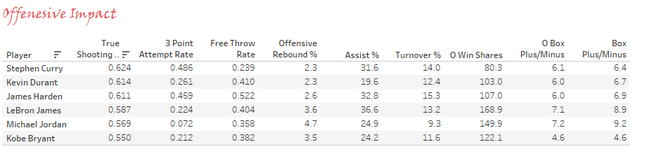
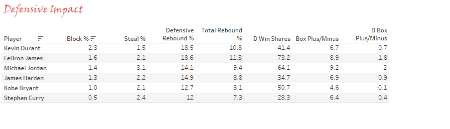
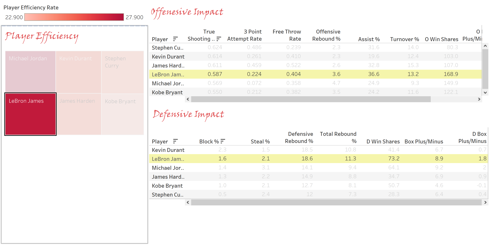

# KING JAMES vs NBA 

---


---

## Background 

King James, The Chosen One, The Akron Hammer are just some of the "aka" names Lebron James has acquired over his 17-year career in the NBA. There is no questioning LeBron’s influence on the game today, with a staggering 10 trips to the NBA Finals with 8 of them being consecutive, also being the only player in NBA history to have won three NBA championships with three franchise as Finals MVP.  Tell me that isn’t a mouthful. I decided to embark on this project on comparing LeBron to some of the most influential players in the past and some who are still playing today to showcase my Tableau skills. Obviously there are many players that we can compare LeBron to, but we are focused on impact. Michael Jordan, Kobe Bryant (R.I.P), Kevin Durant, Stephen Curry, James Harden are players who I feel have had similar influence on the game, but it’s debatable.


## Questions To Explore 

```
1.Which player is more efficient over the span of a career regradless if they're playing or not?
2.What possible predictions could one come up with based on player offensive and defensive effectiveness?
```

To answer these questions, I had to collect data from [basketball-reference](https://www.basketball-reference.com/), which is a data source that deals with anything related to basketball.  I was able to aggragate raw data “Advanced Stats excel spreadsheet" and use Tableau to clean and visulize the data for better insight. 

---


##### Top Dogs
Using Tableau’s tree map feature, puts into perspective on how efficient players where/are through there career. Michael Jordan, with all his greatness is the bar that every player should strive for, coming in at a 27.92 PER (player efficiency rating) which is the highest in NBA & ABA history. LeBron is not far behind with a 27.41 PER, but one would have to wonder if it’s possible for LeBron to ever top Michael in this category with LeBron’s lack of effort in the free throw department.

#### Triple A 
These 3 men have single handedly carved their own paths in the NBA history books. What’s so interesting about this is that Kevin Durant 25.21 PER and James Harden 24.83 PER are both in the top 10 of all time efficiency rating, Durant being number 8 and Harden respectfully 10. Stephen Curry 23.91 PER being the lethal 3-point shooter that he is came in at 16th spot.

#### Mamba
This section was hard to write, but here goes. 
What surprised me the most from this graph had to be Kobe Bryant's 22.90 PER, coming in the 27th spot on the list. With his 5-time NBA championship, 2 scoring titles, 18 All Star appearance, 12-time Defensive titles, 15-time All NBA team, 4 MVPs, and 2 Finals MVP he's done more then what we could ever ask for. Don't forget the 81pt game at home,and  a 60pt game to end his career at home. Kobe has impacted all sports enthusiasts from all walks of life with what he brought to the table, which was the Mamba mentality. Kobe has truly impacted our hearts and the love for the game of basketball. Just wanted to say thank you Kobe for allowing us to witness your greatness, and being an example to us all. 

---

## Offensive Impact 
   
   Tableau always for sorting of columns and rows in the order that would best suit the needs of the insight.  The data collected “Advanced Stats” had offensive and defensive stats all mixed on one table.  What I now did was build  two data frames that consist of individual stats offense and defense.




 Looking at these offensive stats you can already see how Curry takes top spot in the first two columns True Shooting at .624% and 3-point at .486%. Free Throw ratings shows Harden is at the top spot with .522% which tells us he knows how to draw fouls but seems to turn over the ball at a remarkably high rate 15.3%. Jordan knew how to take care of the ball with a 9.3% rating in turn overs and he was also a monster on the offensive rebounds over taking James with a 4.7% rating. Some of the best passes we’ve seen in the game today has definitely come from James and it shows, leading the pack with a 36.6% assist rating and an offensive win shares of 168.9 .  Jordan, James, and Curry are all tied for leading in certain categories, and what does that tell us? Certain players are built specifically for impact. Curry is an anomaly that comes but once in a lifetime, James is perfect hybrid athlete that any mad scientist would take great pride in, and Jordan who’s damn there perfect shooting stroke wins him 2 hat tricks in a single career. Let’s see how everyone stacks up on the defensive end. 

---

## Defensive Impact



Durant’s defensive reactions are A1 as it pertains to blocking, he holds the top spot with a 2.3% blocking rating. I was surprised to see Jordan’s defensive rebound rating at a 14.1% because on the offensive end he is the best at rebounding. Looks like Jordan focused more of his energy on man-to-man defense because his steal rating was the best of any at 3.1%. James’s defensive rebound rating 18.6% is the best in the group he also leads in two other categories total rebounds 11.3%, and defense win shares 73.2 . James has shown why he is called the Chosen One, dominating in three categories. This just showcases how impactful James is as a player which we’ve never seen before in NBA history. He cannot be duplicated, and that’s fact. 

---


## Dashboard Creation 

 Tableau has a feature called dashboard which allows you to view your data all on one screen. You are also able to create highlights, that helps reference information in the data set with just one click.
 
 
 
---

I really hope you enjoyed this project and some of the Tableau skills showen today. I do plan on building more projects following this one.
So, until next time...


---
### Created by

__Nicholas Olumese__, Profile: [LinkedIn](https://www.linkedin.com/in/nicholas-olumese/)


 

