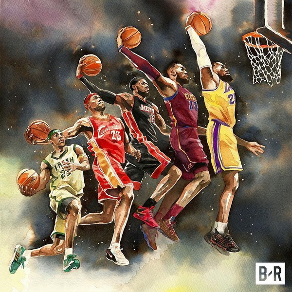
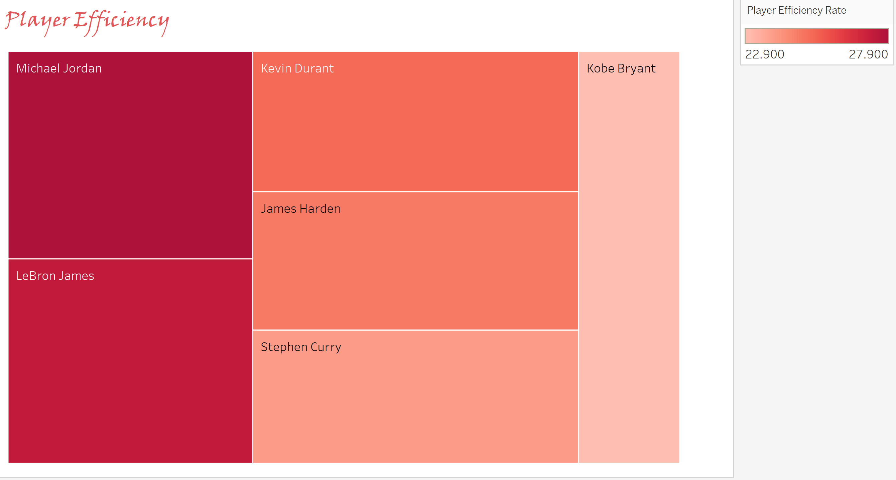

# KING JAMES vs NBA 

---



---

## Background 

King James, The Chosen One, The Akron Hammer are just some of the "aka" names Lebron James has acquired over his 17-year career in the NBA. There is no questioning LeBron’s influence on the game today, with a staggering 10 trips to the NBA Finals with 8 of them being consecutive, also being the only player in NBA history to have won three NBA championships with three franchise as Finals MVP.  Tell me that isn’t a mouthful. I decided to embark on this project on comparing LeBron to some of the most influential players in the past and some who are still playing today to showcase my Tableau skills. Obviously there are many players that we can compare LeBron to, but we are focused on impact. Michael Jordan, Kobe Bryant (R.I.P), Kevin Durant, Stephen Curry, James Harden are players who I feel have had similar influence on the game, but it’s debatable.


## Questions To Explore 

```
1.Which player is more efficient over the span of a career regradless if they're playing or not?
2.What possible predictions could one come up with based on player offensive and defensive effectiveness?
```

To answer these questions, I had to collect data from [basketball-reference](https://www.basketball-reference.com/), which is a data source that deals with anything related to basketball.  I was able to aggragate raw data “Advanced Stats excel spreadsheet" and use Tableau to clean and visulize the data for better insight. 

---



##### Top Dogs
Using Tableau’s tree map feature, puts into perspective on how efficient players where/are through there career. Michael Jordan, with all his greatness is the bar that every player should strive for, coming in at a 27.92 PER (player efficiency rating) which is the highest in NBA & ABA history. LeBron is not far behind with a 27.41 PER, but one would have to wonder if it’s possible for LeBron to ever top Michael in this category with LeBron’s lack of effort in the free throw department.

#### Triple A 
These 3 men have single handedly carved their own paths in the NBA history books. What’s so interesting about this is that Kevin Durant 25.21 PER and James Harden 24.83 PER are both in the top 10 of all time efficiency rating, Durant being number 8 and Harden respectfully 10. Stephen Curry 23.91 PER being the lethal 3-point shooter that he is came in at 16.

#### Mamba
This section was hard to write, but here goes. 
What surprised me the most from this graph had to be Kobe Bryant 22.90 PER coming in the 27th spot on the list.  With his 5-time NBA championship, 2 scoring titles, 18 All Star appearance, 12-time Defensive titles, 15-time All NBA team, 4 MVPs, and 2 Finals MVP is all we could ever ask for. Kobe has impacted all sports enthusiasts from all walks of life with what he brought to the table which was his Mamba mentality, but what Kobe has truly impacted is our hearts and the love for the game. Just wanted to say thank you Kobe for allowing us to witness your best and being an example to us all. 


